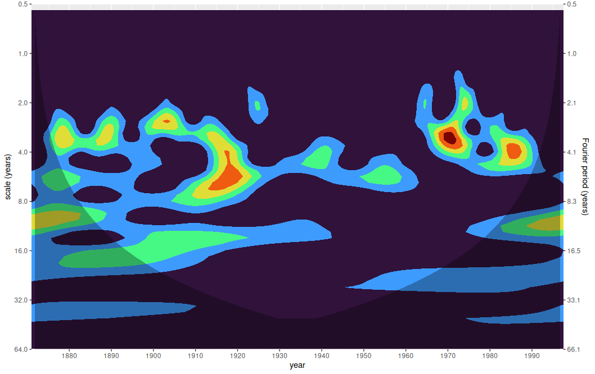

```{r setup, include=FALSE}
knitr::opts_chunk$set(echo = TRUE)
knitr::opts_chunk$set(eval = FALSE)
```

## Wavelet Analysis as per Torrence and Compo, 1998

This is an implementation of the wavelet analysis technique explained in Torrence and Compo's 1998 paper "A Practical Guide to Wavelet Analysis", which set a standard and is often cited as a primary reference. The code is a port to R of Tom Runia's Pytorch implementation, <https://github.com/QUVA-Lab/PyTorchWavelets/>, itself based on Aaron O'Leary's <https://github.com/aaren/wavelets/>.

Following Runia, we use `nn_conv1()` modules to compute the wavelet transform. On larger-size signals, this will not be fast, *unless* you have a GPU. We are therefore considering to add an alternative implementation that follows the common strategy of executing the computation in the Fourier domain.

## Niño example

We show how to perform analysis on the Niño data that make up the number one example in Torrence and Compo.

```{r}
nino_data <- readr::read_table(
  system.file("extdata", "nino3data.asc", package = "torchwavelets"),
  skip = 3,
  col_names = c("time", "sst", "anomaly"))

anomaly <- nino_data[ , 3]%>% unlist() %>% as.numeric() %>% torch_tensor()
dt <- nino_data[ , 1] %>% unlist() %>% as.numeric() %>% diff() %>% mean()

wtf <- wavelet_transform(length(anomaly), dt = dt)
power_spectrum <- wtf$power(anomaly)

times <- nino_data$time
coi <- wtf$coi(times[1], times[length(anomaly)])
```

From the results we obtained, we create two data frames, one containing the scalogram itself, and one holding the specification of the COI, the "cone of influence" that designates the zones where results are not reliable.

```{r}
library(tidyverse)

scales <- as.numeric(wtf$scales)
df <- as_tibble(as.matrix(power_spectrum$t()), .name_repair = "universal") %>%
  mutate(time = times) %>%
  pivot_longer(!time, names_to = "scale", values_to = "power") %>%
  mutate(scale = scales[scale %>% 
               str_remove("[\\.]{3}") %>%
               as.numeric()])

coi_df <- data.frame(x = as.numeric(coi[[1]]), y = as.numeric(coi[[2]]))
```

In the figure, you see which scales (periodicities) were dominant when in the time series; you also see shaded the COI. The closer we are to either start or end, the more unreliable the larger scales (periods).

```{r}
labeled_scales <- c(0.5, 1, 2, 4, 8, 16, 32, 64)
labeled_frequencies <- round(as.numeric(wtf$fourier_period(labeled_scales)), 1)

ggplot(df) +
  #scale_y_continuous(trans = c("log10", "reverse")) + 
  scale_y_continuous(
    trans = scales::compose_trans(scales::log2_trans(), scales::reverse_trans()),
    breaks = c(0.5, 1, 2, 4, 8, 16, 32, 64),
    limits = c(64, 0.5),
    expand = c(0,0),
    sec.axis = dup_axis(
      labels = scales::label_number(labeled_frequencies),
      name = "Fourier period (years)")
    ) + 
  ylab("scale (years)") +
  scale_x_continuous(breaks = seq(1880, 1990, by = 10), expand = c(0,0)) +
  xlab("year") +
  geom_contour_filled(aes(time, scale, z = power), show.legend = FALSE) +
  scale_fill_viridis_d(option = "turbo") +
  geom_ribbon(data = coi_df, aes(x = x, ymin = y, ymax = 64), fill = "black", alpha = 0.3) +
  theme(legend.position = "none")
```


