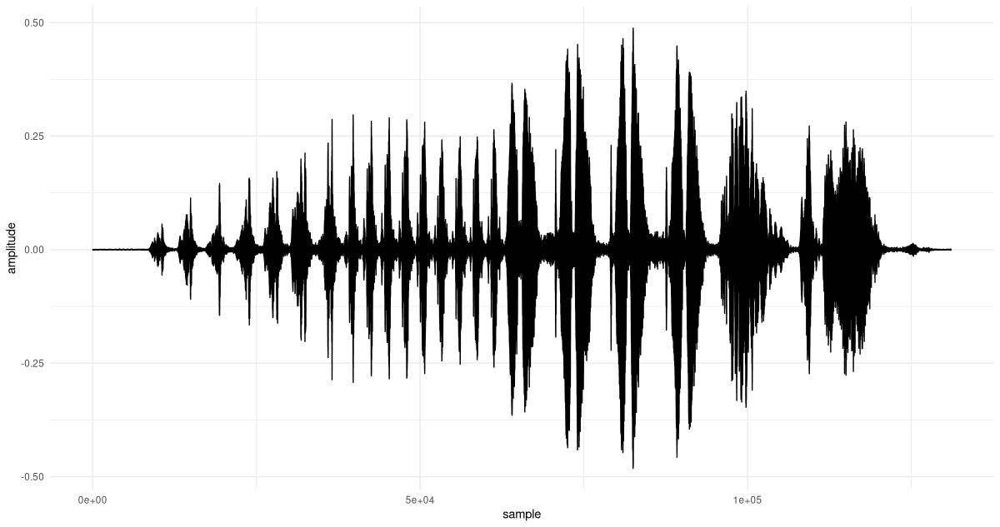
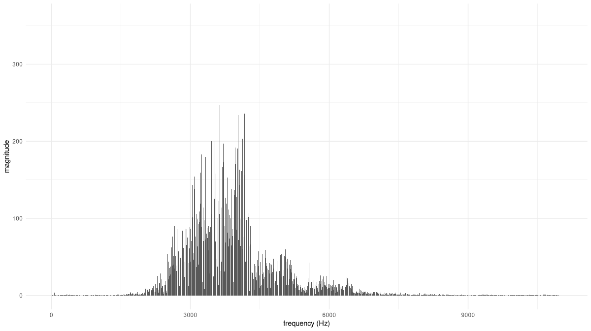
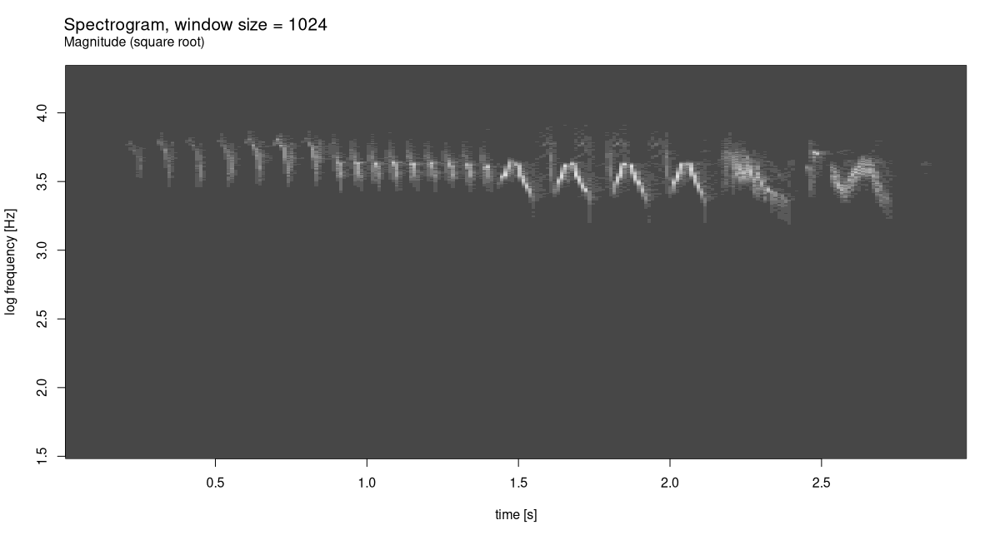
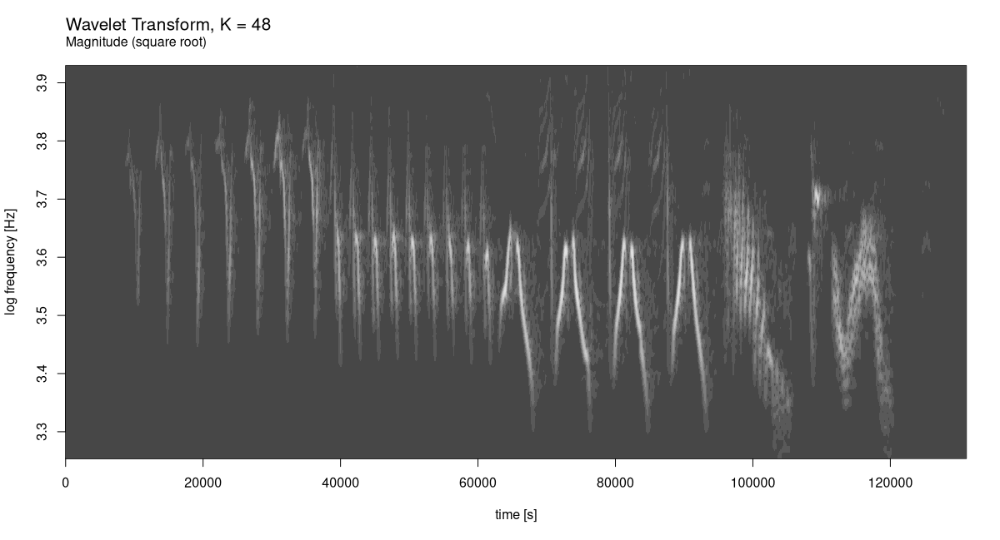

README
================

*Note: This is the beginning of a package for doing wavelet analysis in
R, based on `torch`. As of this writing, it comprises the code (slightly
modified) used in the CRC publication, Deep Learning and Scientific
Computing with R `torch`.*

*Wavelet analysis is a vast domain. Contributors are more than welcome!*

## A real-world example: Chaffinch’s song

This example is discussed in Arnt Vistnes’ fabulous book, *Physics of
Oscillations and Waves*. We download the audio file from his website:

``` r
url <- "http://www.physics.uio.no/pow/wavbirds/chaffinch.wav"

download.file(
 file.path(url),
 destfile = "/tmp/chaffinch.wav"
)
```

We use `torchaudio` to load the file, and convert from stereo to mono
using `tuneR`.

``` r
library(torch)
library(torchwavelets)
library(torchaudio)
library(tuneR)

wav <- tuneR_loader("/tmp/chaffinch.wav")
wav <- mono(wav, "both")
wav
```

    Wave Object
        Number of Samples:      1864548
        Duration (seconds):     42.28
        Samplingrate (Hertz):   44100
        Channels (Mono/Stereo): Mono
        PCM (integer format):   TRUE
        Bit (8/16/24/32/64):    16 

For analysis, we don’t need the complete sequence. Helpfully, Vistnes
also published a recommendation as to which range of samples to analyze.

``` r
waveform_and_sample_rate <- transform_to_tensor(wav)
x <- waveform_and_sample_rate[[1]]$squeeze()
fs <- waveform_and_sample_rate[[2]]

# http://www.physics.uio.no/pow/wavbirds/chaffinchInfo.txt
start <- 34000
N <- 1024 * 128
end <- start + N - 1
x <- x[start:end]

dim(x)
```

    [1] 131072

Here is a time-domain view.

``` r
library(ggplot2)

df <- data.frame(x = 1:dim(x)[1], y = as.numeric(x))
ggplot(df, aes(x = x, y = y)) +
  geom_line() +
  xlab("sample") +
  ylab("amplitude") +
  theme_minimal()
```

<figure>

<figcaption aria-hidden="true">Chaffinch’s song.</figcaption>
</figure>

Now, we need to determine a reasonable range of analysis frequencies. To
that end, we run the FFT:

``` r
F <- torch_fft_fft(x)
```

On the x-axis, we plot frequencies, not sample numbers, and for better
visibility, we zoom in a bit:

``` r
bins <- 1:dim(F)[1]
freqs <- bins / N * fs

# the bin, not the frequency
cutoff <- N/4

df <- data.frame(
  x = freqs[1:cutoff],
  y = as.numeric(F$abs())[1:cutoff]
)
ggplot(df, aes(x = x, y = y)) +
  geom_col() +
  xlab("frequency (Hz)") +
  ylab("magnitude") +
  theme_minimal()
```

<figure>

<figcaption aria-hidden="true">Chaffinch’s song, Fourier spectrum
(excerpt).</figcaption>
</figure>

Based on this distribution, we can safely restrict the range of analysis
frequencies to between, approximately, 1800 and 8500 Hertz. (This is
also the range recommended by Vistnes.)

First, though, let’s anchor expectations by creating a spectrogram for
this signal. Suitable values for FFT size and window size were found
experimentally. And though, in spectrograms, you don’t see this done
often, I found that displaying square roots of coefficient magnitudes
yielded the most informative output.

``` r
fft_size <- 1024
window_size <- 1024
power <- 0.5

spectrogram <- transform_spectrogram(
  n_fft = fft_size,
  win_length = window_size,
  normalized = TRUE,
  power = power
)

spec <- spectrogram(x)
dim(spec)
```

    [1] 513 257

For better comparability with wavelet diagrams, we plot frequencies on a
log scale.

``` r
bins <- 1:dim(spec)[1]
freqs <- bins * fs / fft_size
log_freqs <- log10(freqs)

frames <- 1:(dim(spec)[2])
seconds <- (frames / dim(spec)[2])  * (dim(x)[1] / fs)

image(x = seconds,
      y = log_freqs,
      z = t(as.matrix(spec)),
      ylab = 'log frequency [Hz]',
      xlab = 'time [s]',
      col = hcl.colors(12, palette = "viridis")
)
main <- paste0("Spectrogram, window size = ", window_size)
sub <- "Magnitude (square root)"
mtext(side = 3, line = 2, at = 0, adj = 0, cex = 1.3, main)
mtext(side = 3, line = 1, at = 0, adj = 0, cex = 1, sub)
```

<figure>

<figcaption aria-hidden="true">Chaffinch’s song,
spectrogram.</figcaption>
</figure>

The spectrogram already shows a distinctive pattern. Let’s see what can
be done with wavelet analysis. Like Vistnes, we use the *Morlet*
wavelet. Having experimented with a few different scales, I agree with
Vistnes that `s = 48` makes for an excellent choice:

``` r
library(zeallot)
f_start <- 1800
f_end <- 8500

s <- 48
c(grid, freqs) %<-% wavelet_grid(x, s, f_start, f_end, fs)

plot_wavelet_diagram(
  torch_tensor(1:dim(grid)[2]),
  freqs, grid, s, fs, f_end,
  type = "magnitude_sqrt"
)
```

<figure>

<figcaption aria-hidden="true">Chaffinch’s song, wavelet
diagram.</figcaption>
</figure>

The gain in resolution, on both the time and the frequency axis, is
utterly impressive.
